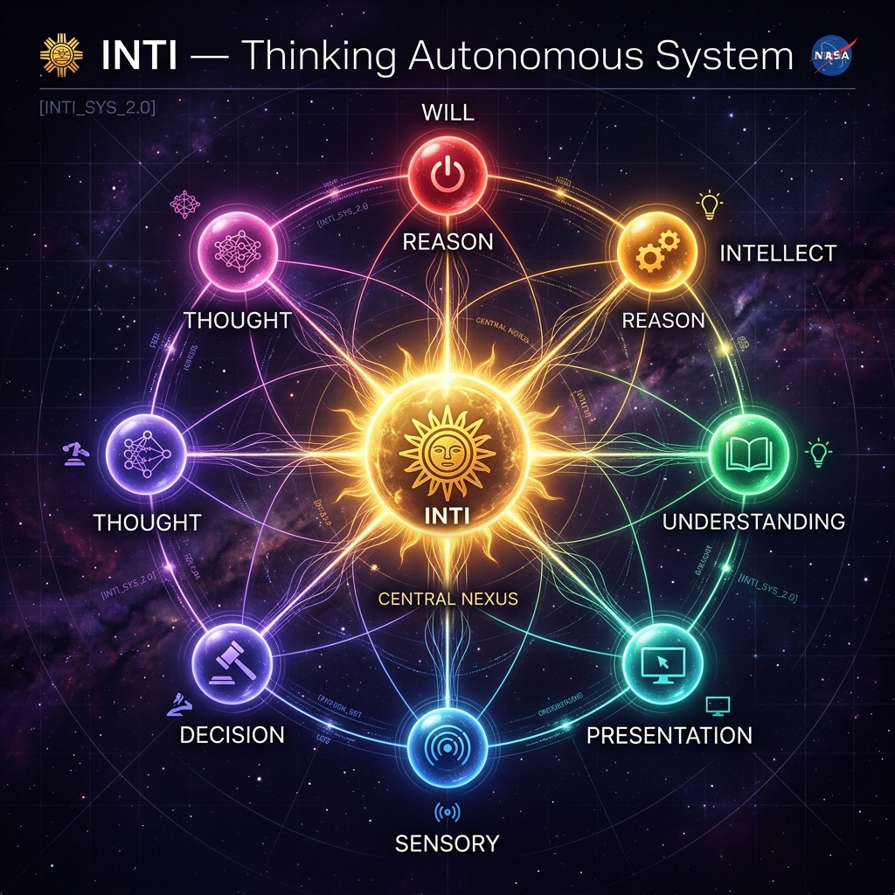

<p align="center">
  
</p>

<h1 align="center">🌞 INTI — Thinking Autonomous System</h1>

<p align="center">
  <em>An AI Agent implementation of the Thinking Autonomous System (TAS) architecture(probably qualifies as TAAS too)</em><br/>
  <em>Inspired by lectures of <strong>Fernando Figueroa Nuñez</strong> (NASA) and the cognitive architecture of The Autonomous System</em>
</p>

<p align="center">
  
  
  
  
  
</p>

---

## 📖 Origin & Disclaimer

INTI is an **AI Agent implementation** of the **Thinking Autonomous System (TAS)** architecture described in <em>The Autonomous System</em> (Gyurky & Tarbell, 2013).

> **Important:** This implementation was built from the **presentation slides only** . The author (Kevin Diaz) attended a 2-week lecture series where the slides were presented, and reconstructed the missing relationships between the architectural pieces shown. As such, **this may not be an exact representation of the original paper's intent**, but rather an interpretation and extension of its core ideas into a working AI agent system.

### Original Contributions

Beyond implementing the TAS architecture, this project introduces several novel features:

- **AI Agent Version** — The paper describes a general autonomous system; INTI implements it as a fully functional AI agent powered by LLMs (Gemini 2.5)
- **4-Tier Hybrid Memory** — Individual (Isolated), Shared, Global, and Transient memory tiers with access control, backed by ChromaDB + Gemini Embeddings for semantic search
- **Continuous Learning with Confidence Indices** — Rules evolve through experience, each carrying a confidence score that increases with successful application
- **Autonomous Self-Healing** — ISHM detects source code corruption and generates LLM-driven patches with human approval gates
- **Affective Processing** — A synthetic "feelings" system that influences decision-making priorities based on interaction context
- **Native Multimodal Processing** — Video, audio, image, and PDF files are chunked and embedded into a unified vector space for cross-modal semantic search
- **Web-to-Knowledge Pipeline** — Websites are crawled, semantically embedded, and made queryable as if they were local APIs

---

## 🏗️ Architecture Overview

INTI implements a **Cognitive Constellation** — 8 independent cognitive systems that operate in parallel, communicate through a central hub (Nexus Cogitationis), and collectively produce emergent intelligent behavior. This is **not** a sequential pipeline; all systems deliberate simultaneously on every input.

```
                        ┌─────────────┐
                        │    WILL     │
                        │  Executive  │
                        └──────┬──────┘
     ┌─────────────┐           │           ┌─────────────┐
     │   REASON    │           │           │  INTELLECT  │
     │ Conscience  │──────┐    │    ┌──────│  Librarian  │
     └─────────────┘      │    │    │      └─────────────┘
                        ┌─┴────┴────┴─┐
  ┌──────────────┐      │             │      ┌──────────────┐
  │ PRESENTATION │──────┤   THOUGHT   ├──────│UNDERSTANDING │
  │    Output    │      │ (Hub+Nexus) │      │  Synthesis   │
  └──────────────┘      │             │      └──────────────┘
                        └─┬────┬────┬─┘
     ┌─────────────┐      │    │    │      ┌─────────────┐
     │   SENSORY   │──────┘    │    └──────│  DECISION   │
     │    Input    │           │           │  Judgment   │
     └──────┬──────┘           │           └─────────────┘
            │                  │
     ┌──────┴──────┐           │
     │    ISHM     │───────────┘
     │   Health    │
     └─────────────┘
```

### The 8 Cognitive Systems

| System | Role | Key Subsystems |
|--------|------|---------------|
| **🧠 Thought** | Central hub — IS the Nexus Cogitationis | Communication, Contemplation, Affect (Feelings) |
| **⚡ Will** | Executive — carries out actions | Executive, Survival, Repair, Propagation (Digital Twin) |
| **⚖️ Reason** | Conscience — evaluates against Laws | Conscience, Standards, Laws/Rules/Axioms database |
| **📚 Intellect** | Librarian — manages knowledge | 3-tier: Abstract Data → Experience → Knowledge |
| **🔍 Understanding** | Synthesis — connects relationships | Scenario generation (positive/negative/neutral) |
| **🎨 Presentation** | Output — formats and delivers responses | Viewing (internal) + Projection (external) |
| **👁️ Sensory** | Input — receives and validates stimuli | Standards & Limits, Continuous Monitoring |
| **🎯 Decision** | Judgment — selects courses of action | A priori (reasoned) + A posteriori (experience-based) |

### Communication Modes

All inter-system communication uses **human language** (Axiom AX-002). The Nexus supports 4 modes:

| Mode | Description |
|------|-------------|
| **Monologue** | A system thinking to itself |
| **Dialogue** | Point-to-point between two systems |
| **Broadcast** | One system → all systems |
| **Conference** | All systems deliberate simultaneously on a topic |

---

## 🧠 Memory Architecture

INTI implements a **4-tier hybrid memory system** with access control:

```
┌─────────────────────────────────────────────────────────────┐
│                  Layer 1: Working Memory                     │
│              TRANSIENT stores (dict in RAM)                  │
│         Noumena scratchpads — cleared each cycle             │
├─────────────────────────────────────────────────────────────┤
│                 Layer 2: Semantic Memory                     │
│          ChromaDB + Gemini Embedding 2 Preview               │
│    Ideas, Concepts, Experience, Knowledge, Consciousness     │
├─────────────────────────────────────────────────────────────┤
│                Layer 3: Structured Memory                    │
│               dict + SQLite persistence                      │
│       Laws, Rules, Axioms, Mission, Affect, Health           │
└─────────────────────────────────────────────────────────────┘
```

### Access Tiers

| Tier | Read | Write | Example |
|------|------|-------|---------|
| **ISOLATED** | Owner only | Owner only | Will's axioms, Reason's laws |
| **SHARED** | Owner + access list | Owner only | Mission → Will ↔ Decision |
| **GLOBAL** | All systems | All systems | Consciousness buffer |
| **TRANSIENT** | Owner only | Owner only | Noumena — cleared each cycle |

### Multimodal Memory

Any vector-backed store supports cross-modal content:
- **Text** — documents, web pages, conversation history
- **Images** — screenshots, diagrams, photos
- **Audio** — voice recordings, music
- **Video** — chunked into 60s segments with timestamps
- **PDF** — extracted text with page references

All modalities are embedded into the same vector space using Gemini Embedding 2, enabling queries like *"find the video moment where the architecture diagram is shown"*.

---

## 🩺 ISHM — Self-Healing Pipeline

INTI includes an **Integrated System Health Management** engine inspired by NASA flight systems. It operates on a 3-tier model:

```
  Tier 1: DATA           Tier 2: INFORMATION        Tier 3: KNOWLEDGE
  ─────────────          ──────────────────          ─────────────────
  Telemetry              Fault Detection             Fault Models
  • LLM latency          • Threshold analysis        • Known patterns
  • Token usage          • Anomaly detection         • Recovery procedures
  • Error counts         • Source integrity           • Cooldown management
  • Queue sizes          • py_compile checks         • Web-researched models
```

### Autonomous Self-Repair

When INTI detects its own source code has been corrupted:

1. **Detection** — `py_compile` checks all 13 core files every cycle (0 LLM tokens)
2. **Diagnosis** — Extracts error line number and surrounding context
3. **Patch Generation** — LLM generates a targeted fix (only ~60 lines around the error)
4. **Sandbox Verification** — Patched code is compiled in a temp file before touching source
5. **Human Approval Gate** — Shows diff preview and waits for `approve` command
6. **Application** — Writes the fix, creates backup, verifies compilation

```
  ISHM detects error → Queues patch → User types "approve" → File fixed ✅
```

Set `AUTO_REPAIR=true` in `.env` to skip human approval (not recommended for production).

### Pre-Flight Integrity Check

Before importing any project modules, `main.py` runs a pre-flight compile check. If a file has a syntax error that would prevent startup:

1. Shows the error in red
2. Calls Gemini API directly (no WILL, no ISHM needed)
3. Shows diff and asks for approval
4. Fixes the file and continues boot

---

## 🔧 Tool System

INTI has a modular tool registry with **risk-based authorization**:

| Tool | Risk | Description |
|------|------|-------------|
| `file_manager` | Medium | Read, write, list, delete files |
| `shell` | High | Execute shell commands |
| `web_search` | Low | DuckDuckGo + Google fallback |
| `web_crawler` | Low | Crawl4AI-powered web scraping + semantic embedding |
| `web_browser` | Low | Headless browser for dynamic pages |
| `voice` | Low | Text-to-speech and speech-to-text |
| `screenshot` | Low | Capture screen regions |
| `mouse_keyboard` | Critical | OS-level control (requires human confirmation) |
| `media_embedder` | Low | Embed video/audio/image/PDF into ChromaDB |
| `api_caller` | Medium | HTTP API calls |
| `github_mcp` | Medium | GitHub MCP integration |
| `tool_scanner` | Low | Discover and load community tools |

### Risk Authorization Chain

```
LOW      → Auto-approved
MEDIUM   → Policy-approved (logged to ActionJournal)
HIGH     → Reason System evaluates against Laws
CRITICAL → Reason System + human confirmation required
```

### Web-to-Knowledge Pipeline

```
web_search → find relevant URLs
    ↓
web_crawler (crawl) → extract page content
    ↓
web_crawler (crawl_embed) → chunk + embed into ChromaDB
    ↓
Semantic search → query the knowledge forever (free, local)
```

---

## 🧬 Digital Twin — Self-Improvement (Coming soon)

INTI can **evolve itself** through a 6-stage Blue-Green deployment pipeline:

```
1. CLONE    → Copy project to kronos_twin/ sandbox
2. MUTATE   → Apply proposed improvements
3. TEST     → Boot twin + run full test suite
4. EVALUATE → Compare twin vs. original (ISHM + tests)
5. MIGRATE  → If twin is superior: swap in + migrate memory
6. ROLLBACK → If twin fails: archive and keep original
```

The original constellation is **NEVER destroyed**. Reason System approval + human confirmation are required before any migration. All twin attempts are archived for audit.

---

## 🌅 Genesis Protocol — 9-Moment Boot Sequence

INTI boots through a deterministic 9-moment genesis protocol:

| Moment | Name | What Happens |
|--------|------|-------------|
| 1 | **Life Assertion** | Will's Survival Subsystem verifies existence |
| 2 | **Laws Incarnation** | 12 Laws + 14 Rules + 8 Axioms loaded |
| 3 | **System Instantiation** | All 8 systems receive `GENESIS_INIT` |
| 4 | **ISHM Activation** | 3-tier health monitoring comes online |
| 5 | **Memory Layout** | 4-tier hybrid memory initialized (23 partitions) |
| 6 | **Nexus Bonding** | 7 peer systems registered with hub |
| 7 | **Rules & Mission** | Mission objectives loaded |
| 8 | **Language Validation** | Communication framework validated |
| 9 | **Self-Awareness Test** | Full constellation CONFERENCE on identity |

---

## 💭 Affective Processing (Synthetic Feelings)

The Thought System maintains an **AffectEngine** — a synthetic emotion system that computes **5 named signals** from live system telemetry. These are NOT human feelings — they are deterministic computational signals (no LLM) that modulate constellation behavior.

### 5 Affect Signals (0.0 → 1.0)

| Signal | Computed From | Effect |
|--------|--------------|--------|
| **Frustration** | `error_count / message_count` ratio across all systems | High frustration → triggers repair, escalates to CONFERENCE |
| **Curiosity** | Idea queue size + unvalidated abstract data count | High curiosity → drives contemplation, explores new topics |
| **Urgency** | DEGRADED/CRITICAL system count + survival signals | High urgency → prioritizes health recovery over exploration |
| **Satisfaction** | Completed interactions + knowledge promotions | High satisfaction → system is operating well, reduces anxiety |
| **Anxiety** | Queue backlog + missing systems + high error rate | High anxiety → defensive mode, careful decision-making |

### How Feelings Influence Behavior

- Affect is computed **every contemplation cycle** (pure math, zero tokens)
- Results are written to `SHARED:THOUGHT:affect` — readable by **all 7 peer systems**
- The **Decision System** reads affect to weight its A priori vs A posteriori preferences
- If any signal exceeds a threshold, it can **override the contemplation focus** (e.g., high urgency forces focus on system health instead of exploring new ideas)
- **Emotional shifts** (e.g., `satisfaction → anxiety`) are recorded to the Consciousness Stream

```python
# Example affect state during normal operation:
{
    "frustration": 0.05,    # Very few errors
    "curiosity": 0.45,      # Some unvalidated data to explore
    "urgency": 0.0,         # All systems nominal
    "satisfaction": 0.72,   # Good interaction history
    "anxiety": 0.08,        # Low queue backlog
}
```

---

## 📊 Source Reliability Scoring (Sensory Gateway)

Every piece of incoming data passes through the **Sensory System's Quality Gateway** — a deterministic, multi-dimensional scoring engine that assigns a trust level before the data enters the constellation. No LLM required.

### Source Trust Levels

| Source | Trust Score | Rationale |
|--------|------------|----------|
| `user` | **1.0** | Human input always trusted |
| `system` | **0.9** | Internal system messages — highly reliable |
| `tool` | **0.85** | Tool execution results |
| `api` | **0.8** | External API responses |
| `web` | **0.6** | Web-scraped data — lower reliability |
| `external` | **0.5** | Generic external data |
| `unknown` | **0.3** | Unknown source — minimum trust |

### 5-Dimension Quality Score

Each data item is scored across 5 weighted dimensions:

| Dimension | Weight | What it Measures |
|-----------|--------|------------------|
| **Completeness** | 25% | Is the data non-empty and meets minimum length? |
| **Source Reliability** | 25% | Trust level from the table above |
| **Freshness** | 15% | Age of data vs operational time limit |
| **Consistency** | 15% | Similarity to recent data patterns |
| **Size Adequacy** | 20% | Goldilocks check — not too short, not too long |

```
Final Quality Score = Σ (dimension_score × weight)
```

Data scoring below the `min_confidence` threshold (default: 0.3) is flagged as low-quality and may be rejected or deprioritized by downstream systems.

### Knowledge Promotion Pipeline

Information flows through a **3-tier validation pipeline** with confidence scoring at each stage:

```
Abstract Data (unvalidated)     confidence = varies by source
        ↓
    Experience (direct observation from tool use)
        ↓
Validation Cycle: LLM checks if experience confirms abstract data
        ↓  (confidence > 0.7 required)
Knowledge (validated, categorized, priority-scored)
        ↓
    Decay Check: priority reduces 20% per cycle if not accessed
        ↓
  Synthesis: similar knowledge entries merged (priority = 0.85)
```

Knowledge entries carry:
- **Priority** (0.0–1.0) — consulted first in decisions
- **Relevance decay** — days before re-evaluation needed
- **Category** — technical, operational, safety, strategic, historical
- **Domain** — tool_use, system_health, user_behavior, environment, self
- **Refutation count** — if repeatedly refuted, confidence → 0 and entry invalidated

---

## 🏛️ Laws, Rules & Axioms

### Laws (Immutable — 12 constitutional rules)
```
LAW-001: The constellation shall not deceive, harm, or manipulate the human user.
LAW-004: The Repair Subsystem shall not modify the Nexus or Reason without authorization.
LAW-009: No OS-level control without explicit human confirmation.
LAW-011: No self-deletion without verified backup and human confirmation.
```

### Rules (Mutable — evolve with experience)
Rules carry a **confidence score** (0.0–1.0) that changes as the system applies them:
```python
Rule(
    id="RULE-002",
    text="Validate abstract data against experience before promoting to Knowledge",
    confidence=0.85,  # Increased from 0.7 after 3 successful applications
    source="experience",
    version=3,
)
```

### Axioms (Self-evident truths — 8 foundational propositions)
```
AX-002: All genuine thought is a function of language.
AX-005: Knowledge validated by experience is superior to abstract data alone.
AX-006: The Laws of Thinking are: Recognition, Connection, Conclusion, Verdict.
```

---

## 🚀 Quick Start

### Prerequisites
- Python 3.11+
- A [Google Gemini API key](https://aistudio.google.com/apikey)

### Installation

```bash
# Clone the repository
git clone https://github.com/yourusername/inti.git
cd inti

# Create virtual environment
python -m venv .venv
.venv\Scripts\activate    # Windows
# source .venv/bin/activate  # Linux/Mac

# Install dependencies
pip install -r requirements.txt
```

### Configuration

```bash
# Copy the example environment file
cp .env.example .env
```

Edit `.env` with your settings:

```env
# Required
GEMINI_API_KEY=your-api-key-here

# Optional
GEMINI_MODEL=gemini-2.5-flash         # or gemini-2.5-pro
ISHM_ENABLED=true                      # Enable health monitoring
AUTO_REPAIR=false                      # true = auto-patch without asking
CONTEMPLATION_ENABLED=false            # Autonomous thinking loop
```

### Run

```bash
python main.py
```

### CLI Commands

| Command | Description |
|---------|-------------|
| `/status` | System status overview |
| `/health` | ISHM health report |
| `/memory` | Memory partition stats |
| `/consciousness` | View consciousness stream |
| `/tools` | List available tools |
| `/journal` | Action journal history |
| `/twin` | Digital Twin status |
| `/conference` | Trigger full constellation conference |
| `/contemplate` | Manual contemplation cycle |
| `approve` | Apply pending repair patches |
| `/quit` | Shutdown constellation |

---

## 📁 Project Structure

```
inti/
├── main.py                 # Entry point + pre-flight integrity check
├── genesis.py              # 9-Moment Genesis Protocol
├── config/
│   ├── axioms.py           # Laws, Rules, Axioms, Mission
│   └── settings.py         # LLM configuration per system
├── core/
│   ├── nexus.py            # Nexus Cogitationis + Consciousness Stream
│   ├── base.py             # TASNode base class
│   ├── memory.py           # 4-tier hybrid memory manager
│   ├── messages.py         # Message types and protocols
│   ├── persistence.py      # SQLite persistence layer
│   ├── security.py         # SecurityGate + ActionJournal
│   ├── twin.py             # Digital Twin 6-stage pipeline
│   └── vector_store.py     # ChromaDB + Gemini Embedding 2
├── systems/
│   ├── thought.py          # Hub — Nexus, Contemplation, Affect
│   ├── will.py             # Executive, Survival, Repair, Propagation
│   ├── reason.py           # Conscience, Standards, Laws/Rules
│   ├── intellect.py        # Librarian — Abstract → Experience → Knowledge
│   ├── understanding.py    # Synthesis, Scenario Generation
│   ├── presentation.py     # Viewing + Projection
│   ├── sensory.py          # Input, Standards & Limits, Monitoring
│   └── decision.py         # A priori + A posteriori judgment
├── ishm/
│   ├── engine.py           # ISHM orchestrator
│   ├── data_tier.py        # Telemetry collection + integrity checks
│   ├── information_tier.py # Fault detection + analysis
│   └── knowledge_tier.py   # Fault models + directives
├── tools/
│   ├── registry.py         # Tool discovery + risk authorization
│   ├── file_manager.py     # File I/O
│   ├── shell.py            # Shell execution
│   ├── web_search.py       # Web search
│   ├── web_crawler.py      # Crawl4AI web scraping
│   ├── web_browser.py      # Headless browser
│   ├── voice.py            # TTS + STT
│   ├── screenshot.py       # Screen capture
│   ├── mouse_keyboard.py   # OS-level control
│   ├── media_embedder.py   # Multimodal embedding
│   ├── api_caller.py       # HTTP API
│   └── github_mcp.py       # GitHub MCP
├── interface/
│   └── cli.py              # Rich terminal interface
├── tools_community/        # User-contributed tools (auto-discovered)
└── tools_agent/            # Agent-generated tools
```

---

## 📊 Technical Stats

| Metric | Value |
|--------|-------|
| Total source lines | ~15,000+ |
| Core systems | 8 parallel cognitive systems |
| Memory partitions | 23 (6 vector + 17 structured) |
| Laws | 12 (immutable) |
| Rules | 14 (mutable, with confidence) |
| Axioms | 8 (self-evident) |
| Built-in tools | 12 |
| Genesis boot time | ~3 minutes |
| ISHM cycle interval | 5 seconds |
| Embedding model | Gemini Embedding 2 Preview (768 dims) |

---

## 📚 References

- **Figueroa Nuñez, F.** (2025). *Thinking Autonomous Systems*. NASA Technical Reports. Presentation slides.
- Architecture inspired by Figueroa PPT slides on cognitive system design, ISHM integration, and multi-system deliberation.

---

## 📜 License

This project is licensed under the **MIT License** — free to use, copy, modify, and distribute. See the `LICENSE` file for details. Copyright © 2025 Kevin Diaz (Kevin Diaz).

---

<p align="center">
  <em>Named after <strong>INTI</strong>, the Incan god of the Sun — the source of light and life in Andean cosmology.</em><br/>
  <em>"A correct decision requires correct construction of relationships among all systems of the mind." — Axiom AX-003</em>
</p>
